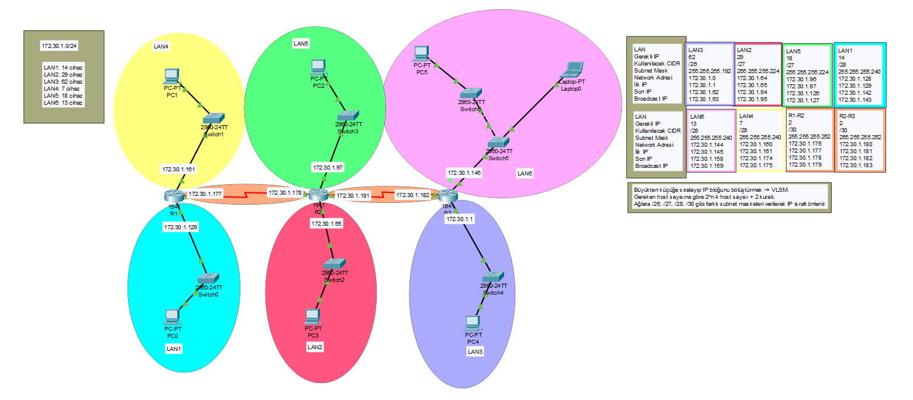

# Subnetting Nedir? Ağlarınızı Daha Akıllıca ve Verimli Yönetin!

Bu depo, ağ mühendisliğinin temel taşlarından biri olan Subnetting ve Variabel Length Subnet Mask (VLSM) kavramlarını derinlemesine inceleyen kapsamlı bir rehber sunmaktadır. IP adresi yönetimini optimize etme, ağ performansını artırma ve ağ güvenliğini güçlendirme konularında hem teorik bilgiler hem de pratik uygulama örnekleri (Cisco Packet Tracer üzerinde) içermektedir.

**Amacı:** Bu rehber, Subnetting ve VLSM'nin temel prensiplerini somut benzetmeler ve gerçek dünya senaryolarıyla anlaşılır kılmayı, böylece ağ tasarımında daha bilinçli kararlar alınmasına yardımcı olmayı hedeflemektedir. Özellikle Cisco Packet Tracer uygulaması ile teorik bilgilerin pratikle pekiştirilmesi amaçlanmıştır.

**İçindekiler:**
* [Subnetting Kavramı ve Avantajları](#subnetting-kavramı-ve-avantajları)
* [Subnet Maskları ve CIDR](#subnet-maskları-ve-cidr)
* [FLSM (Fixed Length Subnet Mask)](#flsm-fixed-length-subnet-mask-sabit-uzunluklu-alt-ağ-maskesi)
* [VLSM (Variable Length Subnet Mask)](#vlsm-variable-length-subnet-mask-değişken-uzunluklu-alt-ağ-maskesi)
    * [Binary Bölme Yöntemi](#vlsm-uygulaması-binary-bölme-yöntemi)
    * [İhtiyaçlara Göre Tablo Yöntemi](#vlsm-uygulaması-ihtiyaçlara-göre-tablo-yöntemi)
* [VLSM Uygulaması: Packet Tracer](#vlsm-ile-ağ-tasarımı-ve-konfigürasyon-packet-tracer-uygulaması)
* [Yönlendirme Protokolü (EIGRP) Yapılandırması](#yönlendirme-protokolü-eigrp-yapılandırması)
* [Yapılandırma Doğrulama ve Testler](#yapılandırma-doğrulama-ve-testler)
* [Sonuç](#sonuç)
* [Kaynaklar](#kaynaklar)

**Nasıl Okunur/Kullanılır:**
* Makalenin tam metni bu depodaki `README.md` dosyasının kendisi içerisinde bulunmaktadır.
* Cisco Packet Tracer uygulama dosyası (`.pkt` uzantılı) bu depoda mevcuttur. Uygulamayı incelemek için [Cisco Packet Tracer](https://www.netacad.com/courses/packet-tracer) yazılımına ihtiyacınız olacaktır.


# Subnetting Nedir?

İnternete bağlı her cihaza bir kimlik vermek isteriz; tıpkı insanların TC kimlik numaraları gibi, ağda da cihazlarımızı **IP adresleriyle** tanırız. Bu IP adresleri bize tahsis edilen büyük bir ağ bloğundan gelir. Ancak bu büyük blok bölünmezse, tek bir devasa ağ içinde kalabalık ve karmaşa kaçınılmaz olur. Peki, bu karmaşayı nasıl yönetebiliriz? İşte burada **Subnetting** devreye giriyor!

Gelin, bu yazımızda subnetting kavramını tüm detaylarıyla, somut benzetmelerle ve gerçek dünya örnekleriyle netleştirelim. Ağlarınızı daha verimli, güvenli ve yönetilebilir hale getirmenin yollarını keşfedin!

---

## Subnetting Kavramını Somutlaştıralım: Üniversite Benzetmesi

Ağımızı büyük bir üniversite kampüsü olarak düşünün. Eğer tüm öğrenciler, tüm dersler, tüm idari birimler aynı devasa alanda, hiçbir ayrım olmaksızın bir arada bulunsa, bu tam bir kaos olmaz mıydı? Herkesin herkese ulaşmaya çalıştığı, bilginin akmadığı bir ortam...

Şimdi bu üniversiteyi fakültelere, enstitülere ve departmanlara ayrılmış olarak hayal edin. Her fakülte kendi içinde düzenlenir, aynı işi yapanlar bir arada toplanır, farklı alanlar birbirinden bağımsız çalışır. Bu sayede hem karmaşa önlenir hem de her fakülte kendi yoğunluğunu yönetebilir. **Subnetting** tam da bunu yapar: bize tahsis edilen büyük IP bloğunu daha küçük, daha düzenli ve yönetilebilir **alt ağlara (subnets)** böler.

---

## Subnetting'in Sağladığı Avantajlar

Bu düzenlemenin bize sunduğu sayısız avantaj var:

* **IP Adresi Verimliliği:** Her alt ağa sadece ihtiyacı kadar IP adresi tahsis edilir ve bu da IP adresi israfını önler. Bunu fakültelerdeki derslikler gibi düşünebilirsiniz. Çok kalabalık dersler için amfiler varken, 20 kişilik sınıflar da mevcuttur. Eğer bu şekilde bir ayrım olmasaydı, 20 kişilik bir sınıf için koskoca bir amfiyi meşgul etmek, kaynak israfına yol açar ve verimliliği düşürürdü.

* **Performans Artışı:** Ağdaki yayın (**broadcast**) trafiği alt ağlarla sınırlanınca, genel ağ yükü azalır ve performans artar. Bir duyuru yapıldığında, bu duyuru sadece ilgili fakülteye yapılarak tüm üniversiteyi meşgul etmek yerine, sadece mesajı üstüne alması gerekenlerin dikkatini çeker. Bu da gereksiz yoğunluğu azaltır.

* **Gelişmiş Güvenlik:** Farklı alt ağlar arasında izolasyon sağlanır, bu da güvenlik politikalarının daha kolay uygulanmasına olanak tanır. Fakültelerimize girerken nasıl ki kartlarımızla erişim kontrolü sağlanır, ağda da **Subnet Mask** bu izolasyonu sağlar. Subnet maskı, bir IP adresinin hangi kısmının ağ kimliğini (**network ID**) ve hangi kısmının cihaz kimliğini (**host ID**) belirttiğini gösterir. Bu sayede, aynı ağ kimliğine sahip cihazlar birbiriyle iletişim kurabilirken, diğerleri izole kalır.

* **Daha Kolay Yönetim ve Sorun Giderme:** Bir ağda sorun çıktığında, tüm üniversite içinde mi yoksa belirli bir fakülte içinde mi aramak daha kolaydır? Elbette daha küçük ve izole edilmiş bir alan, sorunu daha hızlı bulup çözmemizi sağlar.

Kısacası, subnetting, ağlarınızı daha modüler, esnek ve ölçeklenebilir hale getirerek hem kaynak kullanımını optimize eder hem de ağ yönetimini basitleştirir.

## Subnet Maskları ve CIDR: Ağları Bölmenin Temelleri

Subnetting'i anlamak için **Subnet Mask**'ların nasıl çalıştığını kavramak önemlidir. Subnet maskı, bir IP adresinin kaç bitinin ağ adresini (**network bits**) ve kaç bitinin ana bilgisayar adresini (**host bits**) temsil ettiğini söyler. Bilgisayarların dili olan 1 ve 0'larla ifade edildiğinde, ağ bitleri '1' ile, host bitleri ise '0' ile tanımlanır.

**Örneğin:**

11111111.11111111.11111111.00000000 (İkilik Sistem) -> 255.255.255.0 (Ondalık Sistem)

Bu maske aynı zamanda **/24** olarak da gösterilir. /24 demek, 24 tane '1' bitinin yani 24 tane ağ bitinin olduğu anlamına gelir. Bu gösterim, IP adreslerini ve subnet masklarını ifade etmeyi oldukça kolaylaştırır, öyle değil mi?

Geleneksel olarak IP adresleri A, B, C gibi sınıflara ayrılırdı ve her sınıfın varsayılan bir subnet maskı vardı. Ancak günümüzde **Sınıfsız Alanlar Arası Yönlendirme (Classless Inter-Domain Routing - CIDR)** yaygın olarak kullanılmakta olup, bu bize çok daha fazla esneklik sunar. Önceleri /8, /16, /24 gibi kısıtlamalar varken, CIDR ile /27, /30, /12 gibi çok daha esnek bir yapı elde ettik.

---

## Ağları Alt Ağlara Bölme Yaklaşımları: FLSM ve VLSM

Ağımızı alt ağlara bölerken iki temel yaklaşımdan bahsedebiliriz:

### FLSM – Fixed Length Subnet Mask (Sabit Uzunluklu Alt Ağ Maskesi)

Bu yaklaşımda, bir ağdaki tüm alt ağlar aynı boyutta ve aynı sayıda host IP'sine sahiptir. Alt ağlara bölme işlemi yapılırken genellikle kaç tane alt ağa ihtiyaç duyulacağı göz önünde bulundurulur. Bir lise sınıflandırmasını hayal edin; burada sınıflar genellikle aynı veya yakın büyüklüklerdedir. Kaç tane sınıf olacağı daha çok belirleyicidir. Bu gibi durumlarda **FLSM** kullanmak mantıklıdır.

* **Avantajı:** Uygulaması VLSM'ye göre daha basittir.
* **Dezavantajı:** İhtiyaç duyulandan daha büyük alt ağlar oluşturabileceği için IP adresi israfına yol açabilir. Örneğin, tüm alt ağları 254 hostu barındıracak şekilde /24 maskesiyle ayırırsanız, 10 hostluk bir departman için 244 kadar kullanılabilir IP adresi boşta kalmış olur.

## FLSM Örneği: 4 Eşit Alt Ağ Oluşturma

Diyelim ki elimizde **172.16.1.0/24** başlangıç bloğu var (256 IP adresi içerir) ve bu bloğu **4 eşit büyüklükte alt ağa bölmek** istiyoruz.

### FLSM Mantığı: Ağ ID'sinden Bit Ödünç Alma

* **Kaç Alt Ağa İhtiyacımız Var?** 4 alt ağ.
* **Hangi 2'nin Kuvveti Bu Sayıyı Karşılar?** 4 sayısı $2^2$'ye eşittir. Bu **2 sayısı** (yani n=2), bize host (cihaz) kısmından kaç biti ödünç alıp ağ (subnet) kısmına eklememiz gerektiğini gösterir.
* **Yeni CIDR:** Başlangıçta /24 bloğumuz vardı. Host bitlerinden 2 bitini ağ kısmına ödünç aldığımız için, CIDR değerimiz 24 + 2 = **26** yapar. Yani yeni CIDR'miz **/26** olacak!
* **Alt Ağ Büyüklüğü:** Yeni CIDR'miz /26 olduğuna göre, toplam 32 bitin 26'sı ağ adresi için kullanılır. Geriye kalan 32 - 26 = **6 bit** ise host (cihaz) adresleri için kullanılır. Her bir alt ağda $2^6 = 64$ IP adresi bulunur. Unutmayalım ki, bu 64 IP adresinden 2 tanesi kullanılamaz (birisi ağ adresi, diğeri yayın adresi). Yani her alt ağda **64 - 2 = 62 kullanılabilir IP adresi** bulunur.

### Alt Ağların Dağılımı (IP Aralıkları)

Başlangıç IP'miz **172.30.1.0** ve her alt ağımız **64 IP adresi** (veya /26 maskesi) kullanacak. İşte o 4 alt ağ:

#### Birinci Alt Ağ:
* **Ağ Adresi:** 172.30.1.0/26
* **Kullanılabilir IP'ler:** 172.30.1.1 - 172.30.1.62
* **Yayın Adresi:** 172.30.1.63
    *(64 IP'lik blok: 0'dan 63'e kadar)*

#### İkinci Alt Ağ: (Bir önceki yayın adresinin 1 fazlasından başlar: 63 + 1 = 64)
* **Ağ Adresi:** 172.30.1.64/26
* **Kullanılabilir IP'ler:** 172.30.1.65 - 172.30.1.126
* **Yayın Adresi:** 172.30.1.127
    *(64 IP'lik blok: 64'ten 127'ye kadar)*

#### Üçüncü Alt Ağ: (Bir önceki yayın adresinin 1 fazlasından başlar: 127 + 1 = 128)
* **Ağ Adresi:** 172.30.1.128/26
* **Kullanılabilir IP'ler:** 172.30.1.129 - 172.30.1.190
* **Yayın Adresi:** 172.30.1.191
    *(64 IP'lik blok: 128'den 191'e kadar)*

#### Dördüncü Alt Ağ: (Bir önceki yayın adresinin 1 fazlasından başlar: 191 + 1 = 192)
* **Ağ Adresi:** 172.30.1.192/26
* **Kullanılabilir IP'ler:** 172.30.1.193 - 172.30.1.254
* **Yayın Adresi:** 172.30.1.255
    *(64 IP'lik blok: 192'den 255'e kadar)*


## VLSM – Variable Length Subnet Mask (Değişken Uzunluklu Alt Ağ Maskesi)

**VLSM**, alt ağlara bölme yaparken her birim için ihtiyaç duyulan **host sayısına odaklanır**. Bunu yine üniversite fakülteleri benzetmesiyle düşünebilirsiniz. Öğrencileri sınıflara ayıracaksınız ama her dersin sınıf sayısı çok farklı olabilir. Bazı kalabalık dersler için amfi ayırmanız gerekirken, az kişilik dersler için daha küçük sınıflar yeterli olur. Kocaman bir amfiyi az sayıda kişi için meşgul etmek israf olmaz mı?

VLSM tam da bu esnekliği sunar: her alt ağa tam da ihtiyacı kadar IP adresi tahsis edebilir, böylece IP adresi israfını büyük ölçüde azaltabilirsiniz. VLSM, IP adres alanınızı daha verimli kullanmanın ve ağ tasarımınıza maksimum esneklik kazandırmanın modern bir yoludur.

---

## VLSM Uygulaması: Binary Bölme Yöntemi

Şimdi VLSM'yi, IP adreslerinin ikili (**binary**) karşılıklarını kullanarak adım adım nasıl uygulayacağımızı inceleyelim. Bu yöntem, her alt ağı oluşturan mantığı derinlemesine anlamanızı sağlar.

* **Başlangıç Noktamızı Belirleme: Elimizdeki Ağ Bloğu Nedir?**
    Bir VLSM sorusu genellikle size bir başlangıç IP bloğu verir. Diyelim ki elimizdeki ağ bloğu **172.16.1.0/24** olsun.
    * **172.16.1.0** bizim başlangıç IP adresimiz.
    * **/24** ise bu bloğun $2^{(32-24)} = 2^8 = 256$ IP adresi içerdiğini gösterir. Yani, 172.16.1.0'dan 172.16.1.255'e kadar tüm IP'ler bu bloğa aittir.

* **Sihirli Yöntemin Kalbi: Binary (İkili) Bölme Mantığı!**
    Buradaki anahtar nokta, IP adreslerinin ikili (binary) karşılıklarını kullanmak. IP adresleri normalde onluk tabanda (decimal) yazılır ama bilgisayarlar her şeyi ikili (0 ve 1) olarak anlar. 172.16.1.0/24 örneğinde, **son oktet** (yani `.0` kısmı) bizim için önemli. Çünkü /24 olduğu için ilk üç oktet ağ adresi olarak sabitlenmiş durumda. Son okteti ikili olarak yazalım:
    `0 (onluk tabanda) = 00000000 (ikili tabanda)`

    Şimdi, CIDR değeri büyüdükçe (örneğin /26, /27, /28 gibi), bu `00000000` ikili dizisini bölerek yeni alt ağlar oluşturacağız. **Bölme çizgisi (`|`)** bizim için bir sınır olacak.

* **Alt Ağları Ayırma Kuralımız: /26 Örneğiyle Başlayalım**
    Diyelim ki ilk alt ağımızı **/26** olarak ayırmamız isteniyor. /26 demek, ilk 26 bit ağ adresi olacak. IP adresi 32 bitten oluştuğu için, son oktetteki ilk 2 bit (26-24=2) ağ adresine dahil olacak.
    `172.16.1.**00**|**000000**`
    * **Çizginin Solu (`00`):** Bu kısım artık ağ adresine ait ve sabit kalacak.
    * **Çizginin Sağı (`000000`):** Bu kısım ise cihaz adresleri için kullanılacak. Burada 6 bit var ($2^6=64$ IP adresi).

    Şimdi, bu /26 bloğun **Ağ Adresi (Network Address)** ve **Yayın Adresi (Broadcast Address)**'ni bulalım:
    * **Ağ Adresi:** Çizginin sağındaki tüm bitleri 0 yaparsak:
        `172.16.1.00|000000 (ikili) → 172.16.1.0 (onluk)`. Bu, bu alt ağın başlangıç IP adresidir.
    * **Yayın Adresi:** Çizginin sağındaki tüm bitleri 1 yaparsak:
        `172.16.1.00|111111 (ikili) → 172.16.1.63 (onluk)`. Bu, bu alt ağdaki son IP adresidir ve bu ağa gönderilen tüm verilerin ulaşacağı adrestir.
    * **Kullanılabilir IP Aralığı:** 172.16.1.1'den 172.16.1.62'ye kadar.

* **Yeni Alt Ağları Oluşturma Kuralı: Soldan Başlayarak Artırma!**
    Şimdi geldik işin en can alıcı kısmına. Bir sonraki alt ağı oluşturmak için ne yapmalıyız? Kural: Bir önceki alt ağın **Yayın Adresi (Broadcast Address)**'ni alıp, ona **1 ekleyerek** yeni alt ağın Ağ Adresi'ni buluruz.
    Önceki yayın adresimiz: `172.16.1.00|111111` (yani 172.16.1.63). Bu adrese +1 eklediğimizde ne olur?
    `172.16.1.63 + 1 = 172.16.1.64`

    Peki bu 172.16.1.64'ü ikili olarak son oktette nasıl gösteririz? `64 (onluk) → 01000000 (ikili)`. Bir önceki yayın adresini ikili olarak düşünün. Örneğin, `00|111111` (decimal 63). Bu adrese +1 eklemek, ikili sayılarda toplama yapmak gibidir. `...0111111` ifadesine 1 eklediğinizde, sağdan sola doğru 1 olan bitler 0 olur ve bir sola 'elde' gider. İlk 0 olan bit ise 1 olur. Bu işlemin sonucunda `00|111111` (63) adresine 1 eklediğimizde, ikili karşılığı `01000000` (decimal 64) olan yeni ağ adresini buluruz. Artık yeni ağ adresimiz **172.16.1.64** ve ikili olarak son okteti `01000000`.

* **Şimdi /27 ile Devam Edelim!**
    Diyelim ki şimdi **/27** bir alt ağ oluşturmamız isteniyor. /27 demek, ilk 27 bit ağ adresi olacak. Yani son oktetteki ilk 3 bit (27-24=3) ağ adresine dahil olacak. Yeni ağ adresimizin ikili karşılığı `01000000` idi. Şimdi bu `01000000`'ı /27 kuralına göre bölelim:
    `172.16.1.**010**|**00000**`
    * **Çizginin Solu (`010`):** Bu kısım yeni ağ adresine ait ve sabit kalacak.
    * **Çizginin Sağı (`00000`):** Bu kısım ise cihaz adresleri için kullanılacak. Burada 5 bit var ($2^5=32$ IP adresi).

    Şimdi bu /27 bloğun Ağ Adresi ve Yayın Adresi'ni bulalım:
    * **Ağ Adresi:** Çizginin sağındaki tüm bitleri 0 yaparsak: `172.16.1.010|00000 (ikili) → 172.16.1.64 (onluk)`. (Zaten bir önceki broadcast +1 ile bulduğumuz ağ adresiydi!)
    * **Yayın Adresi:** Çizginin sağındaki tüm bitleri 1 yaparsak: `172.16.1.010|11111 (ikili) → 172.16.1.95 (onluk)`.
    * **Kullanılabilir IP Aralığı:** 172.16.1.65'ten 172.16.1.94'e kadar.

### Yöntemin Özeti ve Neden Etkili?

Kısacası, bu yöntemde ana mantık şu:

* IP adreslerinin son oktetini **ikiliye çevirerek görselleştir.**
* CIDR değerine göre (örneğin /26 için ilk 2 bit, /27 için ilk 3 bit vb.) ikili diziye bir **bölme çizgisi (`|`) çek.** Bu çizgi, ağ adresinin bittiği ve cihaz adreslerinin başladığı yerdir.
* Ağ Adresini bulmak için çizginin sağındaki tüm bitleri **sıfır yap.**
* Yayın Adresini bulmak için çizginin sağındaki tüm bitleri **bir yap.**
* Yeni bir alt ağa geçmek için, bir önceki alt ağın **yayın adresine 1 ekle.** Bu yeni sayı, bir sonraki alt ağın başlangıç (ağ) adresi olacaktır.

Bu sistematik yöntem sayesinde:

* **Ezberlemenize gerek kalmaz.** Mantığını kavradığınızda her şeyi kendiniz türetebilirsiniz.
* CIDR değeri değiştikçe ne kadar IP alanına ihtiyacınız olduğunu ve bloğun nereye kadar gideceğini net bir şekilde görürsünüz.
* Her alt ağın IP aralığını **sıfır hatayla** bulabilirsiniz.
* Gerekirse, ikili gösterimle her şeyi kafanızda canlandırabilir, hatta bir kağıt üzerinde kolayca hesaplayabilirsiniz.

## VLSM Uygulaması: İhtiyaçlara Göre Tablo Yöntemi

Bu yöntem, özellikle farklı büyüklükteki ağ ihtiyaçlarınıza göre en verimli çözümü bulmanızı sağlar. Bir önceki binary bölme yöntemine göre biraz daha "tablo odaklı" ve planlıdır.

### Adım 1: Host Sayılarına Göre Alt Ağları Sırala ve Gerekli Bilgileri Belirle

Bu yöntemin ilk ve en kritik adımı, elinizdeki tüm alt ağ (LAN) gereksinimlerini belirleyip, bunları ihtiyaç duyulan host sayısına göre **büyükten küçüğe doğru sıralamaktır.**

Aşağıdaki tabloyu doldururken size yardımcı olacak birkaç önemli bilgi var:

* **Gerekli Host Sayısı:** Her bir LAN veya bağlantı (örneğin, router'lar arası) için kaç cihaza IP adresi atamanız gerektiğini buraya yazın.
* **Gerçek Host Sayısı ($2^n - 2$):** Burası biraz matematik gerektiriyor. Bir alt ağda kullanılabilecek toplam IP adresi sayısı $2^n$ formülüyle bulunur. Ancak, her alt ağda bir ağ adresi (Network Address) ve bir yayın (Broadcast) adresi olmak üzere iki IP adresi rezerve edilir ve cihazlara atanamaz. Bu yüzden, kullanılabilir host sayısı $2^n - 2$'dir.
    * Amacımız, **Gerekli Host Sayısı**'nı karşılayacak en küçük $2^n - 2$ değerini bulmaktır.
    * **Örnek:** Eğer 29 host'a ihtiyacınız varsa:
        * $2^4 - 2 = 16 - 2 = 14$ (Yetersiz)
        * $2^5 - 2 = 32 - 2 = 30$ (Yeterli ve en küçük)
    * Demek ki **n = 5** bitlik bir host alanı gerekiyor.
* **n (Host Bit Sayısı):** $2^n - 2$ formülündeki 'n' değeri, alt ağınız için kaç bitin host (cihaz) adresi olarak ayrıldığını gösterir.
* **CIDR (Sınıfsız Alan Yönlendirme):** 'n' değerini bulduktan sonra CIDR değerini kolayca bulabiliriz. Toplam IP adresi bit sayısı 32'dir. Yani CIDR = 32 - n formülüyle CIDR değerini hesaplarız.
    * **Örnek:** Eğer n = 5 ise, CIDR = 32 - 5 = **/27**.
* **Subnet Mask (Alt Ağ Maskesi):** CIDR değerine karşılık gelen alt ağ maskesidir. (Bir sonraki adımda detaylı anlatacağım).

**Örnek Tablomuz:**

| LAN Adı | Gerekli Host Sayısı | Alt Ağ Boyutu ($2^n$) | n (Host Biti) | CIDR | Alt Ağ Maskesi |
| :------ | :------------------ | :-------------------- | :------------ | :--- | :-------------- |
| Lan 3   | 62                  | 64                    | 6             | /26  | 255.255.255.192 |
| Lan 2   | 29                  | 32                    | 5             | /27  | 255.255.255.224 |
| Lan 5   | 18                  | 32                    | 5             | /27  | 255.255.255.224 |
| Lan 1   | 14                  | 16                    | 4             | /28  | 255.255.255.240 |
| Lan 6   | 13                  | 16                    | 4             | /28  | 255.255.255.240 |
| Lan 4   | 7                   | 16                    | 4             | /28  | 255.255.255.240 |
| R1-R2   | 2                   | 4                     | 2             | /30  | 255.255.255.252 |
| R2-R3   | 2                   | 4                     | 2             | /30  | 255.255.255.252 |

---

### Adım 2: Subnet Mask'ı Hesaplama (CIDR Dönüşüm)

Subnet mask, IP adresinin ağ ve host kısımlarını ayıran 32 bitlik bir sayıdır. CIDR değerine göre bu maskeyi bulabiliriz.

#### Yöntem 1: CIDR'den Maske Üretme (Binary Görselleştirme)

CIDR değeri, maskede kaç tane 1 biti olduğunu gösterir. Geri kalanlar 0'dır.

* **Örnek: /26**
    * **Binary:** `11111111.11111111.11111111.11000000` (İlk 26 bit 1, kalan 6 bit 0)
    * **Decimal (Onluk):** İlk üç oktet 255.255.255 olur. Son oktette `11000000` ikili değeri ise $(1*128) + (1*64) = 192$ eder.
    * **Subnet Mask:** 255.255.255.192

#### Yöntem 2: "n" Değerinden Maske Üretme (Hızlı Yöntem)

Bu yöntem, host bit sayısını ('n') biliyorsanız daha hızlı olabilir. Bir oktet (8 bit) üzerinden düşünelim:

* Toplam 8 bit içerisinde 'n' kadar host biti varsa, 8 - n kadar ağ biti vardır.
* Örneğin, /26 için n=6 idi. Son oktette 8-6=2 adet ağ biti var.
* Bu iki ağ biti `11` şeklindedir. Yani `11000000`.
* Bu da $128 + 64 = 192$ yapar.

---

### Yaygın CIDR ve Maske Tablosu (Bu tabloyu ezberlemek çok işinize yarar!):

| CIDR | Alt Ağ Maskesi | Artış Miktarı (Blok Boyutu) | Kullanılabilir Host Sayısı ($2^n - 2$) |
| :--- | :-------------- | :------------------------- | :--------------------------------- |
| /24  | 255.255.255.0   | 256 (Tüm blok)             | 254                                |
| /25  | 255.255.255.128 | 128                        | 126                                |
| /26  | 255.255.255.192 | 64                         | 62                                 |
| /27  | 255.255.255.224 | 32                         | 30                                 |
| /28  | 255.255.255.240 | 16                         | 14                                 |
| /29  | 255.255.255.248 | 8                          | 6                                  |
| /30  | 255.255.255.252 | 4                          | 2                                  |

## Alt Ağ Maskeleri: Ezberlemeyi Kolaylaştıran Kişisel İpuçlarım

Subnetting öğrenirken sayılar ve maskeler kafamı çok karıştırıyordu. Standart ezberleme yöntemleri bana yeterli gelmedi. Bu yüzden kendime özgü, biraz da **kişisel ipuçları** geliştirdim. Belki siz de bu yöntemlerden faydalanabilirsiniz!

---

### Alt Ağ Maskelerini Akılda Tutma Yöntemim

İşte benim CIDR ve alt ağ maskelerini kolayca ezberlemek için kullandığım bazı ipuçları:

* **/25 (128):** Bu, ikili sistemdeki **ilk bitin değeri** olan 128 olduğu için aklımda kalıyor. En baştaki '1' her şeyi açıklıyor.
* **/26 (192):** '6' sayısının iki ile çarpımından elde ettiğim '12' sayısının birler basamağı olan **'2'den yola çıkarak 192** olduğunu kolayca hatırlıyorum. (6 x 2 = 12, son rakam 2 -> 192)
* **/27 (224):** Benzer şekilde, '7' sayısının iki ile çarpımından gelen '14' sayısının birler basamağı olan **'4', bana 224'ü anımsatıyor.** (7 x 2 = 14, son rakam 4 -> 224)
* **/28 (240):** Burada farklı bir çarpım kullanıyorum: '8'i '5' ile çarptığımda '40' elde ediyorum. Bu da **bana 240'ı çağrıştırıyor.** (8 x 5 = 40, son rakam 0 -> 240)
* **/29 (248):** '9'un iki ile çarpımından elde ettiğim '18' sayısının birler basamağı olan **'8', 248'i hatırlamamı sağlıyor.** (9 x 2 = 18, son rakam 8 -> 248)

Diğer maskelerin son kısımlarını ise sayılar küçüldüğü için aklımdan kolayca hesaplayabiliyorum.

---

Bu ipuçları benim subnetting yolculuğumu çok kolaylaştırdı. Umarım sizin de işinize yarar!

---

### Adım 3: Ağ Adreslerinin Sıralı Hesaplanması

Şimdi, sıraladığımız alt ağlara, başlangıç IP bloğumuzdan başlayarak IP adresleri atayacağız. Başlangıç adresimiz **172.30.1.0** olsun.

Bu adımda kural çok basit: Her alt ağın **Ağ Adresi**, bir önceki alt ağın bitiş noktasından hemen sonra başlar. CIDR değerine karşılık gelen "**Artış Miktarı**" (veya "Block Size") bize alt ağın kaç IP adresi kapladığını gösterir.

* **Lan 3 (/26):**
    * **Ağ Adresi:** 172.30.1.0
    * Bu bir /26 blok, yani **64 IP adresi** kullanıyor (Artış Miktarı 64).
    * 172.30.1.0'dan başlayıp 64 IP sayarsak, bir sonraki blok **172.30.1.64**'ten başlar.

* **Lan 2 (/27):**
    * **Ağ Adresi:** 172.30.1.64 (Önceki Lan 3'ün bitiş noktasından sonra)
    * Bu bir /27 blok, yani **32 IP adresi** kullanıyor (Artış Miktarı 32).
    * 172.30.1.64'ten başlayıp 32 IP sayarsak, bir sonraki blok **172.30.1.96**'dan başlar.

* **Lan 5 (/27):**
    * **Ağ Adresi:** 172.30.1.96 (Önceki Lan 2'nin bitiş noktasından sonra)
    * Bu da bir /27 blok, **32 IP** kullanıyor.
    * 172.30.1.96'dan başlayıp 32 IP sayarsak, bir sonraki blok **172.30.1.128**'den başlar.

...ve bu şekilde tüm alt ağlar için devam edersiniz:

| LAN   | Ağ Adresi     | CIDR | Açıklama                          |
| :---- | :------------ | :--- | :-------------------------------- |
| Lan 3 | 172.30.1.0    | /26  | 64 host'luk                       |
| Lan 2 | 172.30.1.64   | /27  | Lan3'ün bitiş adresinden sonra    |
| Lan 5 | 172.30.1.96   | /27  | Lan2'nin bitiş adresinden sonra   |
| Lan 1 | 172.30.1.128  | /28  | Lan5'in bitiş adresinden sonra    |
| Lan 6 | 172.30.1.144  | /28  | Lan1'in bitiş adresinden sonra    |
| Lan 4 | 172.30.1.160  | /28  | Lan6'nın bitiş adresinden sonra   |
| R1-R2 | 172.30.1.176  | /30  | Lan4'ün bitiş adresinden sonra    |
| R2-R3 | 172.30.1.180  | /30  | R1-R2'nin bitiş adresinden sonra  |

---

### Her Alt Ağın Detaylı Bilgileri

Her alt ağı tanımladığımızda, o alt ağ hakkında 4 temel bilgiye sahip oluruz:

* **Ağ Adresi (Network Address):** Alt ağın başlangıç IP adresi. Cihazlara atanmaz.
* **İlk Host (Kullanılabilir İlk IP):** Ağ adresinden hemen sonraki IP. Cihazlara atanabilecek ilk IP.
* **Son Host (Kullanılabilir Son IP):** Yayın adresinden hemen önceki IP. Cihazlara atanabilecek son IP.
* **Yayın Adresi (Broadcast Address):** Alt ağdaki son IP adresi. Cihazlara atanmaz.

**Örnek (LAN 3):**

* **Ağ Adresi:** 172.30.1.0 (CIDR /26, 64 IP'lik blok)
* **İlk IP:** 172.30.1.1
* **Son IP:** 172.30.1.62
* **Yayın Adresi:** 172.30.1.63 (172.30.1.0'dan itibaren 64. IP - 1)

## Tüm Alt Ağların Detayları:

| LAN   | Ağ Adresi     | Alt Ağ Maskesi  | İlk Kullanılabilir IP | Son Kullanılabilir IP | Broadcast Adresi |
| :---- | :------------ | :-------------- | :-------------------- | :-------------------- | :--------------- |
| LAN 3 | 172.30.1.0    | 255.255.255.192 | 172.30.1.1            | 172.30.1.62           | 172.30.1.63      |
| LAN 2 | 172.30.1.64   | 255.255.255.224 | 172.30.1.65           | 172.30.1.94           | 172.30.1.95      |
| LAN 5 | 172.30.1.96   | 255.255.255.224 | 172.30.1.97           | 172.30.1.126          | 172.30.1.127     |
| LAN 1 | 172.30.1.128  | 255.255.255.240 | 172.30.1.129          | 172.30.1.142          | 172.30.1.143     |
| LAN 6 | 172.30.1.144  | 255.255.255.240 | 172.30.1.145          | 172.30.1.158          | 172.30.1.159     |
| LAN 4 | 172.30.1.160  | 255.255.255.240 | 172.30.1.161          | 172.30.1.174          | 172.30.1.175     |
| R1-R2 | 172.30.1.176  | 255.255.255.252 | 172.30.1.177          | 172.30.1.178          | 172.30.1.179     |
| R2-R3 | 172.30.1.180  | 255.255.255.252 | 172.30.1.181          | 172.30.1.182          | 172.30.1.183     |

---

## Önemli Notlar ve İpuçları

* **Router Bağlantıları (2 cihaz için /30):** Router'lar arası doğrudan bağlantılar genellikle sadece iki IP adresi (her router için birer tane) gerektirir. Bu tür bağlantılar için **/30 maskesi** idealdir, çünkü $2^2 - 2 = 2$ kullanılabilir IP adresi sağlar.
* **Host Sayısı ve $2^n$ Kuralı:** Gerekli host sayınız ne olursa olsun, her zaman $2^n - 2$ formülüyle o sayıyı karşılayacak en küçük 'n' değerini bulmalısınız. Örneğin, 15 host için $2^4 - 2 = 14$ yetersizdir çünkü iki IP (ağ ve broadcast) kullanılamaz. Bu durumda $2^5 - 2 = 30$ olan /27 blok gerekir.
* **Yönlendirme Olmayan Bağlantılar:** Eğer ağlar arasında yönlendirme (routing) yapılmayacaksa, o bağlantılara IP ataması yapmak gereksiz olabilir. Ancak pratik olarak, genellikle tüm bağlantılara IP atanır.

---

## Özetle

**FLSM**, belirli bir IP bloğunu, ihtiyaç duyduğunuz eşit sayıda alt ağa bölmek için kullanılır. Bu yöntemde, alt ağ sayısı ne kadar artarsa, her bir alt ağdaki kullanılabilir IP adresi sayısı o kadar azalır çünkü daha fazla bit ağ kimliğine ayrılmış olur.

Bu yöntem, her alt ağın aynı boyutta olması gerektiği durumlarda basittir ve IP adreslerini eşit olarak dağıtmak için kullanılır. **VLSM** ise, farklı boyutlarda alt ağlara ihtiyaç duyduğumuzda devreye girer ve IP adres alanınızı daha verimli kullanmanın modern bir yoludur.

## VLSM ile Ağ Tasarımı ve Konfigürasyon: Packet Tracer Uygulaması

Bu bölümde, teorik olarak ele aldığımız **VLSM** (Değişken Uzunlukta Alt Ağ Maskesi) kavramını, Cisco Packet Tracer üzerinde gerçekleştirdiğimiz uygulamalı bir senaryo ile pekiştireceğiz. VLSM hesaplamalarını kullanarak farklı alt ağların (subnet) IP yapılanmasını ve cihazlar arası iletişimin nasıl sağlandığını adım adım gözlemleyeceğiz. Amacımız, öğrendiklerimizi somut bir ağ topolojisi üzerinde uygulayarak konuyu daha iyi kavramak ve IP adresi israfını nasıl önlediğimizi göstermek.

---

### Ağ Topolojisi ve Senaryo Özeti

Uygulamamız için merkezde konumlanmış üç ana router (R1, R2, R3) ve bunlara bağlı farklı boyutlarda altı Yerel Alan Ağı (LAN) ile birbirine bağlı WAN bağlantılarından oluşan bir topoloji kullandım. Her bir LAN'ın farklı sayıda cihaza (host) ihtiyacı bulunmaktadır. Bu senaryo, bize VLSM'nin esnekliğini ve IP adresi israfını nasıl önlediğini gösterme fırsatı sunuyor.

Hesaplamalarımızda, **172.30.1.0/24** ana IP bloğundan yola çıkarak, LAN'ların ve WAN bağlantılarının ihtiyaçlarına göre aşağıdaki VLSM dağılımını elde ettim:

| LAN/WAN | İhtiyaç (Host) | Kullanılan CIDR | Subnet Mask     | Network Adresi  | İlk Kullanılabilir IP | Son Kullanılabilir IP | Broadcast IP    |
| :------ | :------------- | :-------------- | :-------------- | :-------------- | :-------------------- | :-------------------- | :-------------- |
| LAN 3   | 62             | /26             | 255.255.255.192 | 172.30.1.0      | 172.30.1.1            | 172.30.1.62           | 172.30.1.63     |
| LAN 2   | 29             | /27             | 255.255.255.224 | 172.30.1.64     | 172.30.1.65           | 172.30.1.94           | 172.30.1.95     |
| LAN 5   | 18             | /27             | 255.255.255.224 | 172.30.1.96     | 172.30.1.97           | 172.30.1.126          | 172.30.1.127    |
| LAN 1   | 14             | /28             | 255.255.255.240 | 172.30.1.128    | 172.30.1.129          | 172.30.1.142          | 172.30.1.143    |
| LAN 6   | 13             | /28             | 255.255.255.240 | 172.30.1.144    | 172.30.1.145          | 172.30.1.158          | 172.30.1.159    |
| LAN 4   | 7              | /28             | 255.255.255.240 | 172.30.1.160    | 172.30.1.161          | 172.30.1.174          | 172.30.1.175    |
| R1-R2   | 2              | /30             | 255.255.255.252 | 172.30.1.176    | 172.30.1.177          | 172.30.1.178          | 172.30.1.179    |
| R2-R3   | 2              | /30             | 255.255.255.252 | 172.30.1.180    | 172.30.1.181          | 172.30.1.182          | 172.30.1.183    |

---

### Packet Tracer Topolojisi

Aşağıdaki görsel, yukarıdaki VLSM hesaplamalarına göre tasarladığımız ağ topolojisini Cisco Packet Tracer ortamında göstermektedir. Bu topoloji, teorik bilgileri somut bir şekilde gözlemlemenizi sağlayacaktır.



Not: Yukarıdaki Packet Tracer topolojisindeki LAN numaralandırması (LAN 1, LAN 2, vb.), VLSM hesaplamalarının yapıldığı host ihtiyacı tablosunun sıralamasından farklılık gösterebilir. Hesaplamalarımız host ihtiyacına göre büyükten küçüğe doğru yapılmıştır.

## Cihaz Konfigürasyonları: Routerlar, Switchler ve PC'ler

Ağdaki her bir router'ın ilgili arayüzüne (interface) belirlenen alt ağlara ait **ilk kullanılabilir IP adreslerini** atadım. Switch'lerde VLAN yapılandırması yapılmadığı için, son kullanıcı cihazlarının (PC'ler) default gateway'lerini bağlı oldukları router arayüzünün IP adresi olarak ayarladım. PC'lere de kendi LAN'larına uygun IP adresleri ve subnet maskları atayarak haberleşme yeteneği kazandırdım.

Aşağıda, her bir router için uygulanan komutları bulabilirsiniz:

### R1 Router Konfigürasyonu:

```cli
R1#en
R1#conf t
R1(config)#int gigabitEthernet0/0
R1(config-if)#ip add 172.30.1.129 255.255.255.240  # LAN 1 için ilk kullanılabilir IP
R1(config-if)#no sh
R1(config-if)#exit
R1(config)#int gigabitEthernet0/1
R1(config-if)#ip add 172.30.1.161 255.255.255.240  # LAN 4 için ilk kullanılabilir IP
R1(config-if)#no sh
R1(config-if)#exit
R1(config)#int serial 0/0/0
R1(config-if)#ip add 172.30.1.177 255.255.255.252  # R1-R2 WAN bağlantısı için ilk kullanılabilir IP
R1(config-if)#no sh
R1(config-if)#exit
R1(config)#end
R1#wr
```
### R2 Router Konfigürasyonu:

```cli
Router>en
Router#conf t
Router(config)#hostname R2
R2(config)#int serial 0/0/0
R2(config-if)#ip add 172.30.1.178 255.255.255.252  # R1-R2 WAN bağlantısı için son kullanılabilir IP
R2(config-if)#no sh
R2(config-if)#exit
R2(config)#int serial 0/0/1
R2(config-if)#ip add 172.30.1.181 255.255.255.252  # R2-R3 WAN bağlantısı için ilk kullanılabilir IP
R2(config-if)#no sh
R2(config-if)#exit
R2(config)#int gigabitEthernet0/0
R2(config-if)#ip add 172.30.1.65 255.255.255.224   # LAN 2 için ilk kullanılabilir IP
R2(config-if)#no sh
R2(config-if)#exit
R2(config)#int gigabitEthernet0/1
R2(config-if)#ip add 172.30.1.97 255.255.255.224   # LAN 5 için ilk kullanılabilir IP
R2(config-if)#no sh
R2(config-if)#exit
R2(config)#end
R2#wr
```

### R3 Router Konfigürasyonu:

```cli
Router>en
Router#conf t
Router(config)#hostname R3
R3(config)#int serial 0/0/1
R3(config-if)#ip add 172.30.1.182 255.255.255.252  # R2-R3 WAN bağlantısı için ilk kullanılabilir IP
R3(config-if)#no sh
R3(config-if)#exit
R3(config)#int gigabitEthernet0/1
R3(config-if)#ip add 172.30.1.145 255.255.255.240  # LAN 6 için ilk kullanılabilir IP
R3(config-if)#no sh
R3(config-if)#exit
R3(config)#int gigabitEthernet0/0
R3(config-if)#ip add 172.30.1.1 255.255.255.192   # LAN 3 için ilk kullanılabilir IP
R3(config-if)#no sh
R3(config-if)#exit
R3(config)#end
R3#wr
```
## Yönlendirme Protokolü (EIGRP) Yapılandırması

Cihazların farklı alt ağlar ve router'lar arasında haberleşebilmesi için bir yönlendirme protokolü gereklidir. Bu senaryoda, **EIGRP (Enhanced Interior Gateway Routing Protocol)** kullandım. EIGRP, Cisco tarafından geliştirilmiş, hızlı yakınsama ve verimli ağ kullanımı sağlayan gelişmiş bir mesafeli vektör protokolüdür.

### Wildcard Mask Nedir ve Nasıl Hesaplanır?

EIGRP gibi bazı yönlendirme protokollerinde, ağ adreslerini belirtmek için geleneksel subnet mask yerine **wildcard mask** kullanılır. Wildcard mask, subnet mask'ın bit bazında tersine çevrilmiş halidir. Bunu en basit ifadeyle, subnet mask'ın "siyaha beyaz, beyaza siyah demesi" olarak düşünebiliriz. Subnet mask'ta '1' olan bitler wildcard mask'ta '0' anlamına gelirken, subnet mask'ta '0' olan bitler wildcard mask'ta '1' anlamına gelir. Bu iki maske birbirini tamamlar.

IP adresimiz genel olarak Network (Ağ) ve Host (Cihaz) kısımlarından oluşur. Bu mantıkla, tüm bitlerin '1' olduğu bir IP adresinden (255.255.255.255), subnet mask'ı çıkararak wildcard mask'ı kolayca bulabiliriz:

$$255.255.255.255 - Subnet Mask = Wildcard Mask$$

**Örnek Hesaplamalar:**

* **/26 (255.255.255.192) için Wildcard Mask:**
    $$255.255.255.255 - 255.255.255.192 = 0.0.0.63$$
* **/27 (255.255.255.224) için Wildcard Mask:**
    $$255.255.255.255 - 255.255.255.224 = 0.0.0.31$$
* **/28 (255.255.255.240) için Wildcard Mask:**
    $$255.255.255.255 - 255.255.255.240 = 0.0.0.15$$
* **/30 (255.255.255.252) için Wildcard Mask:**
    $$255.255.255.255 - 255.255.255.252 = 0.0.0.3$$

Her bir router üzerinde EIGRP 100 (AS numarası) yapılandırması yaparak, doğrudan bağlı olduğu tüm ağları EIGRP sürecine dahil ettim ve `no auto-summary` komutuyla otomatik özetlemeyi kapatarak VLSM'nin doğru çalışmasını sağladım.

### R1 EIGRP Konfigürasyonu:

```cli
R1(config)#router eigrp 100
R1(config-router)#network 172.30.1.128 0.0.0.15   # LAN 1 için wildcard mask (172.30.1.128/28 -> 0.0.0.15)
R1(config-router)#network 172.30.1.160 0.0.0.15   # LAN 4 için wildcard mask (172.30.1.160/28 -> 0.0.0.15)
R1(config-router)#network 172.30.1.176 0.0.0.3    # R1-R2 WAN bağlantısı için wildcard mask (172.30.1.176/30 -> 0.0.0.3)
R1(config-router)#no auto-summary
R1(config-router)#exit
```


### R2 EIGRP Konfigürasyonu:

```cli
R2(config)#router eigrp 100
R2(config-router)#network 172.30.1.64 0.0.0.31    # LAN 2 için wildcard mask (172.30.1.64/27 -> 0.0.0.31)
R2(config-router)#network 172.30.1.96 0.0.0.31    # LAN 5 için wildcard mask (172.30.1.96/27 -> 0.0.0.31)
R2(config-router)#network 172.30.1.176 0.0.0.3    # R1-R2 WAN bağlantısı için wildcard mask (172.30.1.176/30 -> 0.0.0.3)
R2(config-router)#network 172.30.1.180 0.0.0.3    # R2-R3 WAN bağlantısı için wildcard mask (172.30.1.180/30 -> 0.0.0.3)
R2(config-router)#no auto-summary
R2(config-router)#exit

```

### R3 EIGRP Konfigürasyonu:

```cli
R3(config)#router eigrp 100
R3(config-router)#network 172.30.1.180 0.0.0.3    # R2-R3 WAN bağlantısı için wildcard mask (172.30.1.180/30 -> 0.0.0.3)
R3(config-router)#network 172.30.1.0 0.0.0.63     # LAN 3 için wildcard mask (172.30.1.0/26 -> 0.0.0.63)
R3(config-router)#network 172.30.1.144 0.0.0.15  # LAN 6 için wildcard mask (172.30.1.144/28 -> 0.0.0.15)
R3(config-router)#no auto-summary
R3(config-router)#exit
```

## Yapılandırma Doğrulama ve Testler

Konfigürasyonları tamamladıktan sonra ağın doğru bir şekilde çalıştığını doğrulamak kritik öneme sahiptir. Aşağıdaki komutları kullanarak EIGRP komşuluklarını, yönlendirme tablolarını ve protokol bilgilerini kontrol ettim:

```cli
Router# show ip eigrp neighbors
Router# show ip ip route eigrp
Router# show ip eigrp protocols
Router# show ip eigrp topology
```

Bu komutların yanı sıra, farklı alt ağlardaki PC'ler arasında `ping` komutunu kullanarak uçtan uca bağlantıyı test ettim. Örneğin, LAN1'deki bir PC'den LAN4'teki bir PC'ye ping atarak iletişimin sorunsuz gerçekleştiğini gözlemledim. Bu testler, VLSM tabanlı IP adreslemenin ve EIGRP yönlendirmesinin beklendiği gibi çalıştığını teyit etmenizi sağladı.

Broadcast mesajlar ise (örneğin ARP istekleri), sadece kendi alt ağları içinde kalır ve router'lar tarafından diğer alt ağlara iletilmez. Bu da subnetting'in performans artışı ve ağ yükünü azaltma avantajını somut bir şekilde gösterir.

## Sonuç

**Subnetting**, modern ağ tasarımının temel direklerinden biridir ve ağ mühendislerinin IP adresi alanını en verimli şekilde kullanmasını sağlar. Özellikle **VLSM** ile birlikte, ağlara esneklik ve ölçeklenebilirlik kazandırarak kaynak israfını önler ve performansı artırır. Packet Tracer gibi simülasyon araçlarıyla yaptığınız uygulamalı çalışmalar, teorik bilgileri pratiğe dökmek ve bu önemli becerileri pekiştirmek için paha biçilmezdir.

Umarım bu yazı, subnetting ve VLSM hakkındaki bilgilerinizi pekiştirmenize ve kendi ağ tasarımlarınızda daha bilinçli kararlar almanıza yardımcı olur.

---

**Kaynaklar:**

* [Mürşide Öden]. (10.06.2025). *Subnetting Nedir? Ağlarınızı Daha Akıllıca ve Verimli Yönetin!*.
* Cisco Systems. (2023). *Configure IP Addresses and Unique Subnets for New Users*. Erişim Adresi: [https://www.cisco.com/c/en/us/support/docs/ip/routing-information-protocol-rip/13788-3.html](https://www.cisco.com/c/en/us/support/docs/ip/routing-information-protocol-rip/13788-3.html).

